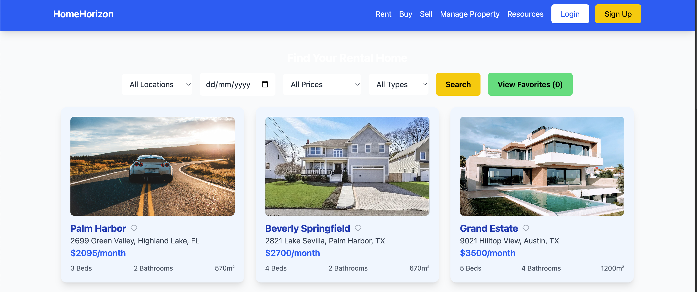
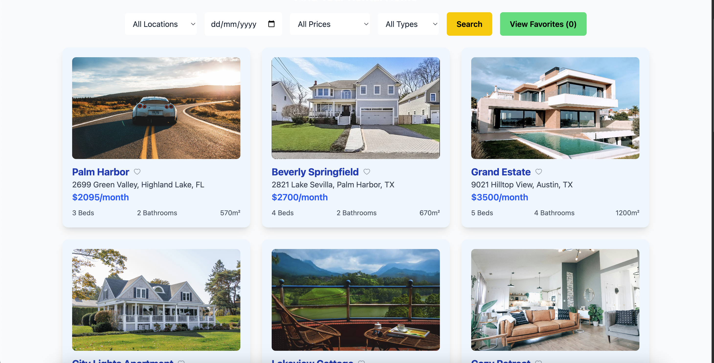

# HomeHorizon

## Overview

**HomeHorizon** is a web application designed to help users search for rental properties based on location, price range, and move-in date. The app provides a seamless user experience for finding, filtering, and saving rental properties for later review. The key feature of this application is the ability for users to search and filter properties, view detailed property information, and save properties to their favorites list.

The app allows users to:
- Search properties based on various filters such as location, price, and property type.
- View individual property details in an easy-to-navigate format.
- Save favorite properties for future reference.
- View images of properties in a modal when clicked.

## Features

- **Property Search:**
  - Search properties by location, price range, move-in date, and property type.
  - Filter properties based on price range (e.g., $500 - $2,500, $2,500 - $5,000).
  - Filter by move-in date and other attributes.

- **Property Cards:**
  - Display properties in a card format with details like name, price, location, and size.
  - Each property card features an image and a heart icon for marking it as a favorite.

- **Favorites:**
  - Users can click the heart icon to mark properties as their favorites.
  - View the list of favorite properties with an easy toggle between showing all properties and just favorites.

- **Full-Screen Modal:**
  - When clicking on a property image, a full-screen modal appears displaying the image in a larger size.

- **Responsive Design:**
  - Fully responsive for both desktop and mobile devices.

## Screenshots

### Landing Page with navbar and filter section

### Property cards

### Modal

## Tech Stack

- **Frontend:** React.js
- **Styling:** Tailwind CSS
- **Icons:** React Icons
- **State Management:** React Hooks (useState, useEffect)

## Extra Packages Used

- **React Icons:** For using heart icons (for favorites).
- **Tailwind CSS:** For utility-first CSS to style the application.
- **React Modal:** Used for creating the full-screen modal.

## Learnings from the Project

- How to integrate React with responsive design using Tailwind CSS.
- Implementing dynamic filtering functionality with React hooks.
- Working with React components for displaying and managing UI elements such as property cards and modals.
- Managing state for favorites and search filters.
- Handling image modals and creating a smooth user experience for image viewing.

## Future Improvements

- **User Authentication:** Allow users to sign up/login and save their favorite properties permanently.
- **Backend Integration:** Integrate with a backend server or a database to fetch properties and save favorites.
- **Advanced Filtering:** Add more advanced filtering options like number of bathrooms, pets allowed, and more.
- **Pagination:** Implement pagination for property listings instead of displaying all properties at once.

## Live Link

[View HomeHorizon live](https://homehorizon-aniket.vercel.app/)

---

Thank you for checking out the HomeHorizon project! Feel free to explore and contribute.
